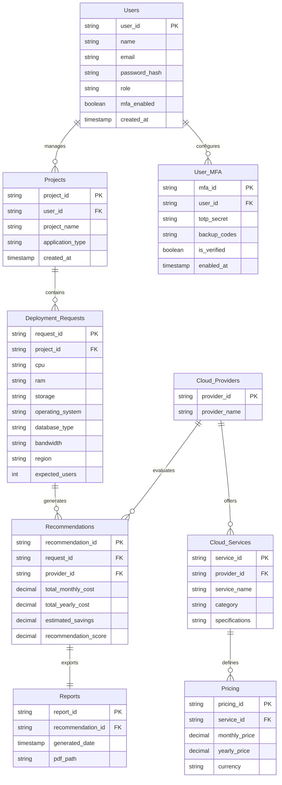

# ⚡ CostMatrix: Multi-Cloud FinOps & Infrastructure Placement Engine

[](LICENSE)
[](https://spring.io/projects/spring-boot)
[](https://reactjs.org/)
[](https://www.mysql.com/)
[]()

<div align="center">
  
</div>

**CostMatrix** is an enterprise-grade Multi-Cloud FinOps and Infrastructure Placement Platform engineered to eliminate cloud overspending, prevent cloud vendor lock-in, and automate infrastructure cost matching across major cloud service providers: **Amazon Web Services (AWS), Microsoft Azure, Google Cloud Platform (GCP), and Oracle Cloud Infrastructure (OCI)**.

Designed for DevOps teams, FinOps engineers, and enterprise architects, CostMatrix continuously ingests CSP pricing feeds, normalizes complex tariffs, evaluates deployment workloads against SLAs, and delivers actionable infrastructure placement recommendations with automated cost audit reports.

---

## ✨ Enterprise Features

### 🛡️ Enterprise Security & MFA Authentication
- **Multi-Factor Authentication (MFA / 2FA):** Native TOTP support (Google Authenticator, Authy, 1Password) with 6-digit time-based one-time passcodes and single-use emergency backup recovery codes.
- **Role-Based Access Control (RBAC):** Granular authorization models (`SuperAdmin`, `FinOpsManager`, `DevOpsEngineer`, `Auditor`).
- **Stateless JWT Sessions:** Secure dual-token rotation scheme (short-lived Access Tokens with long-lived Refresh Tokens).

### ⚡ Intelligent Cost & Placement Engine
- **Multi-Cloud Live API Ingestion:** Direct integration with AWS Price List API, Azure Retail Prices API, GCP Billing Catalog API, and OCI Cost Management API.
- **Spec-Driven Workload Optimizer:** Evaluates vCPU, RAM, NVMe/SSD/HDD Storage, Operating Systems, Managed Database Engines, Egress Traffic, and Geographic Regions.
- **Weighted Multi-Factor Scoring Engine:** Balances raw cost efficiency ($60\%$), spec-to-instance match exactness ($25\%$), and regional vendor SLA availability ($15\%$).
- **Circuit Breaker Resilience & Fallback Caching:** Automatic fallback to high-speed Redis/MySQL cached pricing snapshots during vendor API rate-limiting or outages.

### 🎨 Modern Light Glassmorphism UX/UI
- **FutureForge Aesthetic:** Custom non-generic, high-contrast light aesthetic engineered specifically for enterprise workflows (Crisp White Canvas `#FFFFFF`, Cyan Glass Borders, Neon Cyan Accent `#06B6D4`, Emerald Savings Indicator `#10B981`).
- **Interactive FinOps Dashboard:** Real-time data charts, multi-cloud cost matrices, and provider side-by-side spec visualizers.
- **Executive Report Generation:** One-click automated PDF/CSV export for finance and C-suite audit reporting.

<div align="center">
  
  <p><em>*Example of Data Analytics & Cloud Cost Dashboard Visualizations</em></p>
</div>

---

## 🎨 UI Design System & Aesthetic Identity

CostMatrix features a custom-built, modern UI identity that avoids generic templates and AI visual clichés:

| Aesthetic Token | Value / Hex Code | Applied Elements |
| :--- | :--- | :--- |
| **Canvas Background** | `#F8FAFC` (Slate Light) | Main Application Canvas & Page Containers |
| **Surface Card** | `#FFFFFF` (White Glass) | Dashboard Widgets, Spec Input Forms, Provider Cards |
| **Primary Accent** | `#06B6D4` (Electric Cyan) | Primary Buttons, Active Navigation, Key Stat Highlights |
| **Secondary Accent**| `#8B5CF6` (Vivid Violet) | Recommendation Badges & Provider Comparison Gauges |
| **Savings Indicator**| `#10B981` (Emerald Green) | Cost Reduction % Metrics & Savings Callouts |
| **Alert/Warning** | `#F43F5E` (Rose Coral) | Cost Anomaly Alerts & Security/MFA Warnings |
| **Typography** | `Outfit`, `Inter` | Clean geometric headers, crisp body text |

<div align="center">
  
</div>

---

## 🏗️ System Architecture

CostMatrix uses a resilient, 4-tier micro-component backend powered by Java 17 / Spring Boot and React 18:

```
+-----------------------------------------------------------------------------------------+
|  1. Presentation Layer (React 18 + Titanium Glass UI Engine)                            |
|  [ Modern Web Dashboard ]  --->  [ MFA Challenge View ]  --->  [ PDF / CSV Report ]      |
+--------------------------------------------+--------------------------------------------+
                                             | Secure REST API (Bearer JWT + MFA Header)
+--------------------------------------------v--------------------------------------------+
|  2. Application & Security Layer (Spring Boot 3.2)                                      |
|  [ Spring Security ] ---> [ JWT Token Manager ] ---> [ MFA / TOTP Provider Engine ]      |
|  [ User Management ] ---> [ Workspace RBAC ]   ---> [ Project Lifecycle Manager ]      |
+--------------------------------------------+--------------------------------------------+
                                             |
+--------------------------------------------v--------------------------------------------+
|  3. Business Logic Layer (FinOps Engine)                                                |
|  Req Collector  ──►  Pricing Aggregator  ──►  Normalizer  ──►  Cost & SLA Engine       |
|       │                                                           │                     |
|       └───────────────►  Executive PDF Generator  ◄───────────────┴─ Scoring Engine     |
+--------------------------------------------+--------------------------------------------+
                                             |
+--------------------------------------------+--------------------------------------------+
|  4. Data & Resilience Layer                                                             |
|  [ MySQL 8.0 Primary Storage ]             [ External Cloud Provider APIs ]            |
|  [ Redis Pricing Snapshot Cache ]          (AWS, Azure, GCP, Oracle Cloud APIs)         |
+-----------------------------------------------------------------------------------------+
```

---

## 🔐 Authentication & MFA (TOTP) Security Flow

```
[ User Log-in ] ──► Validate Credentials ──► [ Password Valid? ]
                                                    │
                                             YES    ▼
                                     Check MFA Configuration
                                                    │
                   ┌────────────────────────────────┴────────────────┐
                   ▼                                                 ▼
        [ MFA Enabled: TRUE ]                             [ MFA Enabled: FALSE ]
                   │                                                 │
        Prompt 6-Digit TOTP Code                           Issue Full Access Token
                   │                                                 │
      Validate Code via TOTP Engine                                  ▼
                   │                                          [ Redirect to Dashboard ]
            Valid? ┴────────► Issue JWT Access & Refresh Tokens
```

---

## 🔢 Cost Calculation & Scoring Methodology

The recommendation engine calculates a unified **Recommendation Score ($S_p$)** for candidate cloud provider $p$:

$$S_p = 0.60 \cdot \left(1 - \frac{C_p}{C_{\text{max\_provider}}}\right) + 0.25 \cdot \text{Match}_{\text{spec}} + 0.15 \cdot \text{Reliability}_{\text{region}}$$

Where:
- **Total Monthly Cost ($C_p$):** 
  $$C_p = C_{\text{compute}} + C_{\text{storage}} + C_{\text{database}} + C_{\text{bandwidth}}$$
- **Region Reliability Score ($\text{Reliability}_{\text{region}}$):** Quantified directly from vendor-published SLA uptime commitments per region (e.g., AWS $99.99\% \rightarrow 0.9999$).
- **Spec Exactness Match ($\text{Match}_{\text{spec}}$):** Proportional compliance against target vCPU, RAM ratios, storage IOPS, and OS engine compatibility.

---

## 🗄️ Database Schema & Data Model (ERD)

The MySQL database schema includes complete support for MFA secrets, backup recovery codes, workspace projects, multi-provider service catalogs, and report audit tracking.



---

## 🛠️ Technology Stack & Selection Rationale

| Component | Technology | Rationale |
| :--- | :--- | :--- |
| **Frontend Framework** | **React 18 + Vite** | Component modularity, stateful dashboard charts, sub-second HMR. |
| **Styling & Icons** | **Custom CSS Variables + Lucide Icons** | Zero-utility overhead, bespoke Titanium Glass dark mode aesthetics. |
| **Backend Service** | **Java 17 / Spring Boot 3.2** | High-throughput asynchronous multi-threading (`CompletableFuture` & Virtual Threads) for non-blocking concurrent API calls across 4 cloud vendors. |
| **Security & Auth** | **Spring Security, JWT, TOTP (QRCodes)** | Enterprise grade security with MFA compliance. |
| **Caching & Fault Tolerance** | **Redis 7.0 + Resilience4j** | In-memory price snapshot caching and circuit breaking for high availability. |
| **Database** | **MySQL 8.0** | Relational data integrity for multi-tenant users, catalog pricing, and reports. |
| **External Cloud APIs** | **AWS, Azure, GCP, OCI APIs** | Real-time multi-cloud price synchronization. |

---

## 📡 Core API Endpoints

### Authentication & MFA Management
- `POST /api/v1/auth/register` - Create user account
- `POST /api/v1/auth/login` - Authenticate primary credentials (returns temporary pre-MFA token if MFA enabled)
- `POST /api/v1/auth/mfa/setup` - Generate TOTP secret QR code URL & recovery codes
- `POST /api/v1/auth/mfa/verify` - Validate 6-digit TOTP code and issue final JWT access token
- `POST /api/v1/auth/mfa/disable` - Disable 2FA (requires valid password + MFA code)

### Workspaces & Deployment Requests
- `GET  /api/v1/projects` - List workspace projects
- `POST /api/v1/projects` - Initialize new deployment project
- `POST /api/v1/projects/{projectId}/requests` - Submit workload spec request

### Cost Optimization Engine & Audit Reports
- `POST /api/v1/requests/{requestId}/evaluate` - Trigger multi-cloud cost evaluation engine
- `GET  /api/v1/requests/{requestId}/recommendations` - Retrieve provider rankings & savings metrics
- `GET  /api/v1/recommendations/{recommendationId}/report/pdf` - Export audit PDF report
- `GET  /api/v1/recommendations/{recommendationId}/report/csv` - Export raw comparison CSV

---

## ⚡ Quickstart Deployment Guide

### Prerequisites
- **Java 17 OpenJDK** or higher
- **Node.js (v18+)**
- **MySQL 8.0** & **Redis 7.0**

### 1. Database & Cache Initialization
```bash
# Start MySQL and Redis via Docker Compose
docker-compose up -d mysql redis
```

### 2. Backend Configuration & Start
```bash
cd backend
mvn clean install
mvn spring-boot:run
```
*Backend Service:* `http://localhost:8080`

### 3. Frontend Configuration & Start
```bash
cd frontend
npm install
npm run dev
```
*Frontend Web App:* `http://localhost:5000`

---

## 📄 License

Distributed under the **MIT License**. See `LICENSE` for more information.
